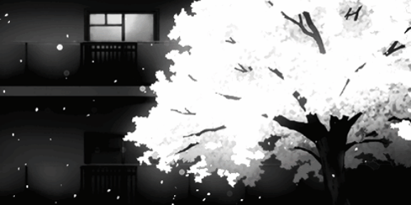

<p align="center">
  
</p>
<!--  -->

<!--  -->
<!-- <br/> -->
<!-- Short -->

```bash
$ neofetch --config info

Name      : Tanish
Age:      : 15
Role      : Student

OS        : Arch Linux
Kernel    : linux-zen
WM        : Hyprland
Shell     : fish
Editor    : Neovim

Languages : C, C++, TypeScript
Interests : Full-stack · Mobile · Systems
```

<!-- medium
```bash
$ whoami

Name       : Tanish
Age        : 15
Occupation : Student

"Everything is an abstraction,
waiting to be broken down."
```
```bash
$ neofetch

OS          : Arch Linux
Kernel      : linux-zen
WM          : Hyprland
Shell       : fish
Editor      : Neovim
Terminal    : kitty

Languages   : C, C++, TypeScript
Interests   : Full-stack · Mobile · Systems
```-->
<!--Full-->
<!--```bash
$ ls ~/projects/

lockin/
hyprcaption/
random-ideas-that-became-real/
```
```bash
$ cat currently_learning.md

- React Native
- DSA (C++)
- System Design
```
```bash
$ echo $STATUS

Building.
```-->

<!-- <details> -->
<!--   <summary>Contacts</summary> -->
<!--  <br/> -->
  
<!--  Portfolio: [rainbowdesert57.github.io](https://rainbowdesert57.github.io) *(WIP)* <br/> -->
<!--  Contact: Email: [tanishj1711@proton.me](mailto:tanishj1711@proton.me)  **|**  Discord: [@Sandbox](https://discord.com/users/795929788250193920) <br/> -->
<p align="left">
  <a href="mailto:tanishj1711@proton.me">
    
  </a>
  <a href="https://discord.com/users/795929788250193920">
    
  </a>
</p><!-- </details> -->
